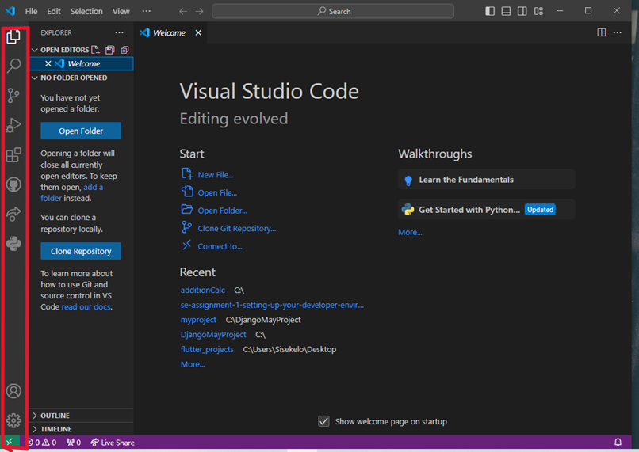
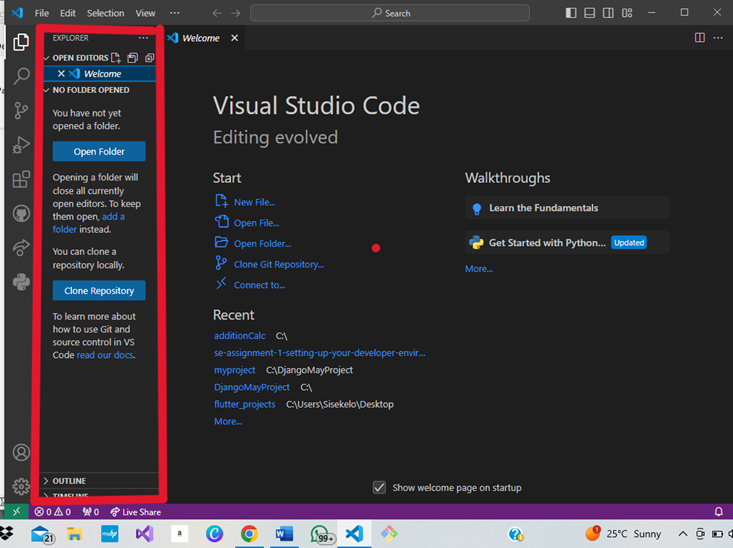
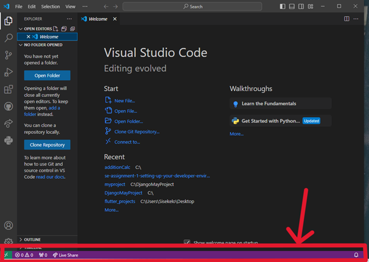
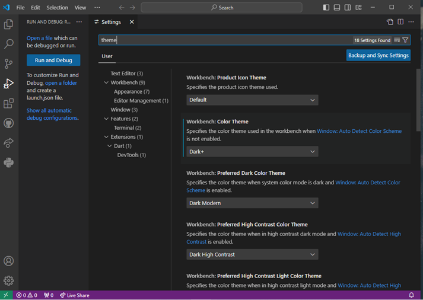

# SE-Assignment-5
Installation and Navigation of Visual Studio Code (VS Code)
 Instructions:
Answer the following questions based on your understanding of the installation and navigation of Visual Studio Code (VS Code). Provide detailed explanations and examples where appropriate.

 Questions:

1. Installation of VS Code:
   - Describe the steps to download and install Visual Studio Code on Windows 11 operating system. Include any prerequisites that might be needed.

   	Installation of VS Code
•	Go to https://code.visualstudio.com/ to download the latest version for Windows
•	Once download is complete install it
•	During installation you will accept the license agreement and choose installation location then finish the installation when its done 
Prerequisites
a.	Windows 11 installed
b.	Atleast 1.6GHz processor 

2. First-time Setup:
   - After installing VS Code, what initial configurations and settings should be adjusted for an optimal coding environment? Mention any important settings or extensions.

   •	You need to install extensions which is on left side of the Activity Bar: like Python (choose the verified one) this will optimize your coding with features such as automated indentation

3. User Interface Overview:
   - Explain the main components of the VS Code user interface. Identify and describe the purpose of the Activity Bar, Side Bar, Editor Group, and Status Bar.

  3.	User Interface Overview: 
•	Activity Bar: It provides different views like the Explorer, Search, Source Control, Run and Debug, Extensions

 
•	Side Bar: It displays different panels according to your Activity Bar selection for example file explorer
 

•	Editor Group: This is where you edit files
•	Status Bar:  Shows information about the project you are working on such as line number, git branch , errors and warnings

 

4. Command Palette:
   - What is the Command Palette in VS Code, and how can it be accessed? Provide examples of common tasks that can be performed using the Command Palette.
	Command Pallette
•	It allows you to search and execute various commands , such as  ‘Open File’ to open a file; ‘Run Code’ for a running your code
•	you can press ctrl+shift+P 

5. Extensions in VS Code:
   - Discuss the role of extensions in VS Code. How can users find, install, and manage extensions? Provide examples of essential extensions for web development.•	They provide added functionality to support different programming languages, debuggers and tools
•	We can find extenssions on the left on the Activity bar then you can search for the desired extension

6. Integrated Terminal:
   - Describe how to open and use the integrated terminal in VS Code. What are the advantages of using the integrated terminal compared to an external terminal?
   •	To open you can click ‘View > Terminal’
•	Advantages is that you do not leave VS code to execute commands you can just access directly through the editor

7. File and Folder Management:
   - Explain how to create, open, and manage files and folders in VS Code. How can users navigate between different files and directories efficiently?
•	Creating files: Right click on the Explorer and select New File or New Folder
•	Navigation: Use the Explorer view to Navigate Files

8. Settings and Preferences:
   - Where can users find and customize settings in VS Code? Provide examples of how to change the theme, font size, and keybindings.
   •	To customize settings go to ‘File> Preferences > Settings’
•	Example for changing the theme: search for colour theme to change the appearance, Font size: change the ‘Editor Font Size’ setting

9. Debugging in VS Code:
   - Outline the steps to set up and start debugging a simple program in VS Code. What are some key debugging features available in VS Code?
   •	Open Run and Debug view from the Activity Bar from there you can step through the code using ‘Step Over’, ‘Step into’ , ‘Step out’ , you can also inspect variables and watch expressions as well as evaluate the in the Debug console

10. Using Source Control:
    - How can users integrate Git with VS Code for version control? Describe the process of initializing a repository, making commits, and pushing changes to GitHub.
    •	To integrate with git you can open source control in the Activity Bar and initialize a Git repository from there
•	After that you can make your changes and commit (add commit message too)
•	You can use the command palette to push to a remote repository

 Submission Guidelines:
- Your answers should be well-structured, concise, and to the point.
- Provide screenshots or step-by-step instructions where applicable.
- Cite any references or sources you use in your answers.
- Submit your completed assignment by 1st July 

